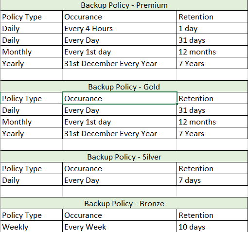

<p align="center">
  <a href="" rel="noopener">
 </a>
</p>

<h3 align="center">AWS Backup Terraform</h3>
[](https://github.com/ankitosh/aws-backup-terraform/actions/workflows/blank.yml)
<div align="center">

</div>

---

<p align="center"> Backup Solution for resources in AWS Cloud.
    <br> 
</p>

## 📝 Table of Contents

- [About](#about)
- [Getting Started](#getting_started)
- [Usage](#usage)
- [Built Using](#built_using)
- [Authors](#authors)

## 🧐 About <a name = "about"></a>

AWS Backup enables you to centralize and automate data protection across AWS services.
Most of the organization on AWS wants to leverage the AWS Backup solution but not sure what to backup ? or what should be the schedule ?

This terraform template enables the orgnization/ System Admin to choose Backup solution they require.

## Backup Schedule


## 🏁 Getting Started <a name = "getting_started"></a>

These instructions will help the deloy the template on your AWS Environment for development and testing. See [Usage](#Usage) for notes on how to deploy the project on a live system.

### Prerequisites

What things you need to install the software and how to install them.
  1. Hashicorp's Terraform  [check this link for terraform installation](https://www.terraform.io/downloads.html)
  2. AWS Credentials or IAM Role attached to instance.


## 🎈 Usage <a name="usage"></a>

1. clone [This](https://github.com/ankitosh/aws-backup-terraform.git) repo.
    ```
    git clone https://github.com/ankitosh/aws-backup-terraform.git
    ```
2. enter your details in provider.tf ( if using Access Key and Secret)
    ```
    provider "aws" {
        access_key  = var.access_key
        secret_key  = var.secret_key
        region     = var.region_name
    }
    ```
    If using Iam role Attached to instance.
    un comment
    ```
        data "aws_caller_identity" "current" {}
    ```
    & comment the provider section
    ```
     provider "aws" {
        access_key  = var.access_key
        secret_key  = var.secret_key
        region     = var.region_name
    } 
    ```
    optional
    enter your Bucket details if state management is remote
    ```
    terraform {
        backend "s3" {
            bucket        = "YOUR-BUCKET-NAME-tf-state-dev"
            key           = "YOUR_BACKUP_SCHEDULE.tfstate"
            region        = "YOUR_REGION_BUCKET"
            encrypt       = true
        }
    }
    ```
2. Run terraform plan command to verify the resource to be deployed.
    ```
    terraform plan 
    ```
3. run terraform apply command to deploy the resources
    ```
    terraform apply
    ```
## ⛏️ Built Using <a name = "built_using"></a>

- [Terraform](https://www.hashicorp.com/) - Template

## ✍️ Authors <a name = "authors"></a>

- [@ankitosh](https://github.com/ankitosh) - Idea & Initial work 
